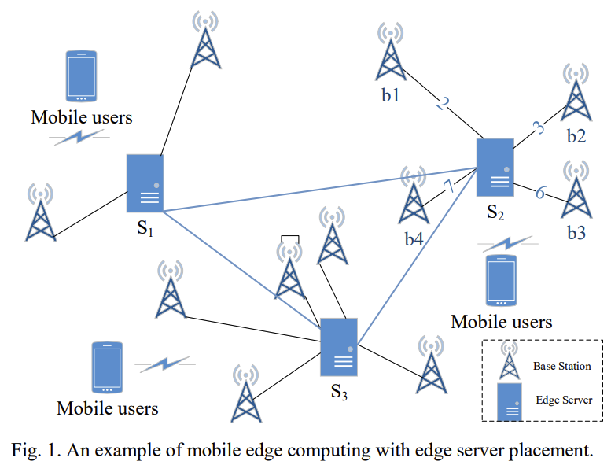

# Edge Server Placement

## Problem Formulatiom

### Mobile Edge Environment

Edge server placement problem can be considered as a network. which is an undirected graph $G = (V, E)$, where

- $V = B \cup S$
  - $B$: the set of **Base stations**
  - $S$: the set of **Edge servers**

- $E$
  - **The links between base stations and edge servers**
  - The links between base stations and mobile users
  - The links between base stations

## Reference

| Author                 | Paper                                          | Publication | Year |
| ---------------------- | ---------------------------------------------- | ----------- | ---- |
| Yuanzhe Li et al.      | Profit-aware Edge Server Placement             | IoTJ        | 2021 |
| Shangguang Wang et al. | Edge server placement in mobile edge computing | JPDS        | 2019 |
